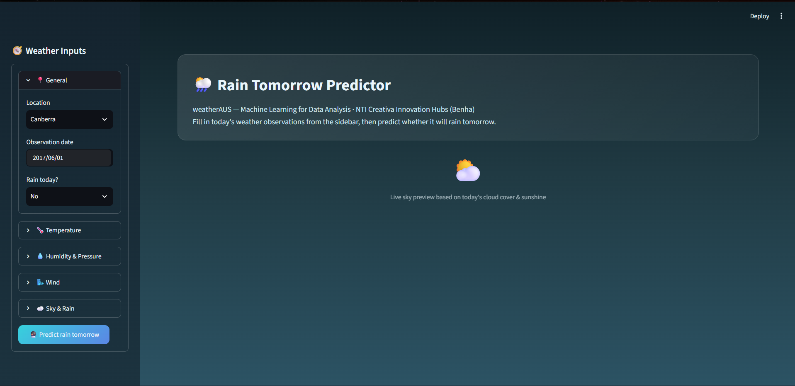
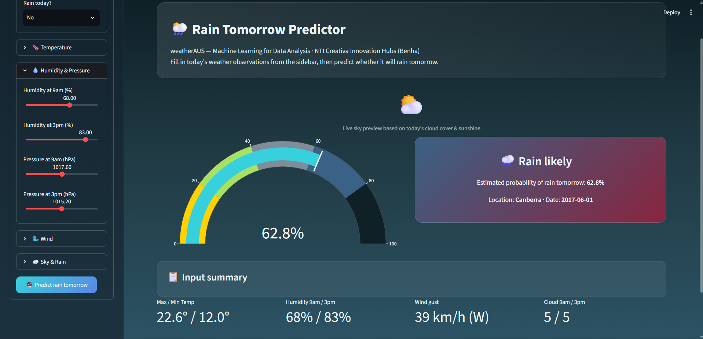

# 🌧️ Rain Prediction ML

A complete Machine Learning project developed during the **NTI Creativa Innovation Hub Program (Benha Branch)**.

This project predicts whether it will rain tomorrow using historical Australian weather data. It covers the complete machine learning workflow, starting from data preprocessing and exploratory data analysis (EDA), through feature engineering, model training, evaluation, and deployment using Streamlit.

---

## 🚀 Live Demo

👉 [Open the Live Application](https://rain-prediction-ml-w4kov8lxpkvufsad3pnymf.streamlit.app/)

The application allows users to enter weather measurements and receive a prediction of whether it will rain the following day.

---

## 📌 Project Overview

Predicting rainfall is an important weather forecasting task that can support agriculture, transportation, water resource management, and disaster prevention.

In this project, several Machine Learning algorithms were trained and compared to determine a suitable model for rainfall prediction.

The final trained model was deployed using **Streamlit** to provide an interactive web application for real-time inference.

---

## 🎯 Project Objectives

- Clean and preprocess raw weather data.
- Perform Exploratory Data Analysis (EDA).
- Engineer meaningful features.
- Train multiple Machine Learning models.
- Compare model performance.
- Select the best-performing model.
- Save the trained model using Pickle.
- Build an interactive Streamlit application.
- Deploy the project for inference.

---

## 📂 Dataset

### Dataset Name

**WeatherAUS Dataset**

### Target Variable

**RainTomorrow**

- Yes
- No

The dataset contains historical Australian weather observations collected from multiple weather stations.

The observations include:

- Temperature
- Humidity
- Atmospheric Pressure
- Sunshine
- Wind Speed
- Rainfall
- Cloud Cover
- Evaporation
- Wind Direction
- And other weather-related attributes.

### Dataset Source

👉 [WeatherAUS Dataset on Kaggle](https://www.kaggle.com/datasets/trisha2094/weatheraus)

The dataset is not included in this repository. The original dataset can be accessed through the source above.

---

## 🛠 Technologies Used

- Python
- Pandas
- NumPy
- Matplotlib
- Seaborn
- Scikit-Learn
- Streamlit
- Pickle
- JSON

---

# ⚙️ Machine Learning Pipeline

The project follows a complete Machine Learning workflow.

## 1. Data Cleaning

The data preprocessing stage included:

- Removing duplicated records.
- Handling missing values.
- Removing invalid observations.
- Fixing inconsistent values.

---

## 2. Feature Engineering

Several additional features were created to improve the representation of the weather data, including:

- Pressure Difference
- Temperature Difference
- Wind Speed Categories
- Humidity Indicators

These engineered features were used to provide additional information to the Machine Learning models.

---

## 3. Data Preprocessing

The preprocessing pipeline included:

- Numerical feature scaling.
- Categorical feature encoding.
- Column Transformer.
- Pipeline integration.

Using a preprocessing pipeline helps ensure that the same transformations are applied consistently during training and inference.

---

## 4. Model Training

Multiple Machine Learning classification models were trained and compared, including:

- Logistic Regression
- Decision Tree
- Random Forest
- Gradient Boosting
- XGBoost (if available)
- Other classification models

The models were evaluated using several performance metrics to identify the best-performing model.

---

## 5. Model Evaluation

The trained models were evaluated using:

- Accuracy
- Precision
- Recall
- F1 Score
- ROC AUC
- Confusion Matrix
- ROC Curve

The best-performing model was selected and saved for deployment.

---

# 📊 Feature Importance

Feature importance analysis showed that several weather-related variables had a significant contribution to the prediction task.

Important variables included:

1. Humidity at 3 PM
2. Pressure at 3 PM
3. Wind Gust Speed
4. Pressure Difference
5. Sunshine

These features provided useful information for predicting rainfall on the following day.

---

# 💾 Saved Model

The final trained model is stored in:

```text
rain_prediction_model.pkl
```

Additional model and preprocessing metadata is stored in:

```text
model_meta.json
```

These files are used by the Streamlit application during inference.

---

# 🖥️ Streamlit Application

The trained Machine Learning model was deployed using **Streamlit**.

The application allows users to:

- Enter weather measurements.
- Submit the input data.
- Predict whether it will rain tomorrow.
- Display the prediction result through an interactive interface.

---

# 📸 Application Preview

## Home Page



---

## Prediction Result



---

# 📁 Repository Structure

```text
Rain-Prediction-ML
│
├── Documentation/
│   └── RainPrediction_Documentation.pdf
│
├── Notebook/
│   └── WEATHERAUS_FINAL_updated.ipynb
│
├── Screenshots/
│   ├── home.png
│   └── prediction.png
│
├── app.py
├── rain_prediction_model.pkl
├── model_meta.json
├── requirements.txt
├── README.md
└── LICENSE
```

---

# 📄 Documentation

The complete project documentation is available here:

👉 [View Project Documentation](Documentation/RainPrediction_Documentation.pdf)

The documentation provides a detailed explanation of the project workflow, preprocessing, Machine Learning models, evaluation, and deployment.

---

# ▶️ Installation

## 1. Clone the Repository

```bash
git clone https://github.com/mohamed-tamer-UT/Rain-Prediction-ML.git
```

## 2. Move Into the Project Directory

```bash
cd Rain-Prediction-ML
```

## 3. Install Dependencies

```bash
pip install -r requirements.txt
```

## 4. Run the Streamlit Application

```bash
streamlit run app.py
```

The application will then be available locally through the Streamlit server.

---

# 📈 Results

The selected model achieved strong predictive performance after applying:

- Data Cleaning
- Feature Engineering
- Data Preprocessing
- Model Comparison
- Hyperparameter Tuning

The final model was integrated into a Streamlit application to provide real-time rainfall predictions.

---

# 🔮 Future Improvements

Possible future improvements include:

- Advanced cloud deployment.
- Docker containerization.
- API development using FastAPI.
- Continuous model retraining.
- Real-time weather API integration.
- Advanced ensemble techniques.

---

# 👨‍💻 Author

**Mohamed Tamer**

NTI Creativa Innovation Hub Program  
Benha Branch  
Machine Learning Track

---

# ⭐ Support

If you found this project useful, consider giving the repository a ⭐ on GitHub.
